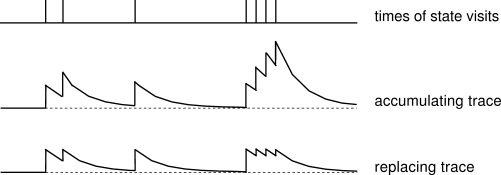
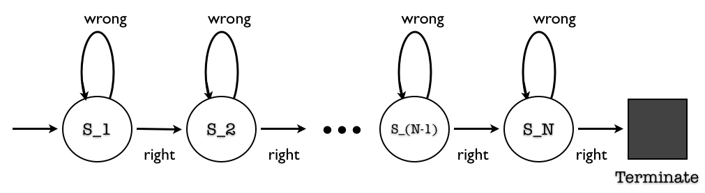
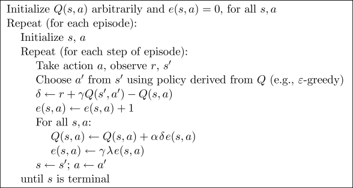
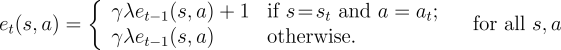
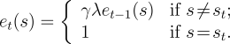
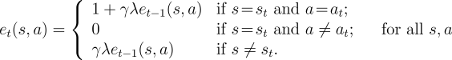

<h1> Accumulating vs. Replacing Eligibility Traces for a Simple Task</h1>

 C. Vic Hu

	<h3> Introduction </h3>
	

		When using eligibility traces in TD(lambda) methods, we often hope to propagate learning results along the traveled trajectories to reflect the gained knowledge in relevant value functions as well as to increase the learning efficiency. However, if we simply accumulate traces propagated from every predecessor visits, bad actions in a state may end up catching more weights than good ones simply because of inaccurate sampling, resulting erroneous value approximation. Therefore, replace-trace methods are introduced to reset eligibility trace everytime a new visit is sampled on a state. The figure bellow borrowed from Sutton & Barto's textbook clearly illustrates the difference between accumulate-trace and replace-trace methods.
		 
		 
		
		 
		 
		Adapting Exercise 7.7 from Sutton & Barto's textbook, in this exercise we wish to demonstrate the effectivenss of replace-trace method through a simple deterministic and episodic task with N nodes as following: Starting from state S_1, the agent will decide to take either action 'right' or 'wrong' in each state, which will bring it to the next state or the same state respectively. On taking action 'right' at the last state S_N, the agent receives a reward of value one and the episode terminates. The rewards for all other state-actions are zero.
		 
		 
		
		 
	

	<h3> Methods </h3>
	

		In this exercise, we will run a tabular Sarsa(lamba) with various learning parameter values (lambda, eta, alpha and gamma), according to the following algorithm provided by Sutton & Barto:
		 
		 
		
		 
		 
		with the normal accumulating traces (used by the above algorithm):
		
		 
		 
		In addition, we will compare our results with two different replace-trace methods. One that resets everytime the same state is revisited:
		 
		 
		
		 
		 
		The other one that accumulates for the same state-action pairs, reset to zero for same state but different actions, and propagates for all other states on the trajectory:
		 
		 
		
		 
		 		
	

	<h3> Results </h3>
	

		
	

	<h3> Conclusion </h3>
	

		
	

