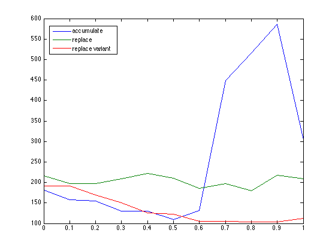
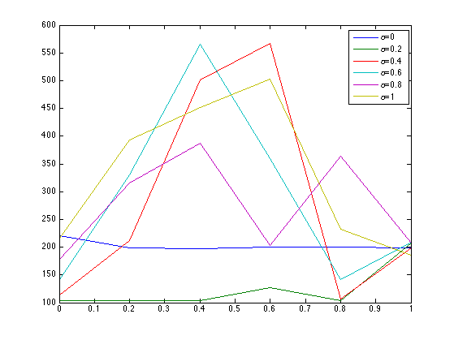

<h1> Accumulating vs. Replacing Eligibility Traces for a Simple Task</h1>

 C. Vic Hu

	<h3> Introduction </h3>
	

		When using eligibility traces in TD(lambda) methods, we often hope to propagate learning results along the traveled trajectories to reflect the gained knowledge in relevant value functions as well as to increase the learning efficiency. However, if we simply accumulate traces propagated from every predecessor visits, bad actions in a state may end up catching more weights than good ones simply because of inaccurate sampling, resulting erroneous value approximation. Therefore, replace-trace methods are introduced to reset eligibility trace everytime a new visit is sampled on a state. The figure bellow borrowed from Sutton & Barto's textbook clearly illustrates the difference between accumulate-trace and replace-trace methods.
		 
		 
		
		 
		 
		Adapting Exercise 7.7 from Sutton & Barto's textbook, in this exercise we wish to demonstrate the effectivenss of replace-trace method through a simple deterministic and episodic task with N nodes as following: Starting from state S_1, the agent will decide to take either action 'right' or 'wrong' in each state, which will bring it to the next state or the same state respectively. On taking action 'right' at the last state S_N, the agent receives a reward of value one and the episode terminates. The rewards for all other state-actions are zero.
		 
		 
		
		 
	

	<h3> Methods </h3>
	

		In this exercise, we will run a tabular Sarsa(lamba) with various learning parameter values (lambda, eta, alpha and gamma), according to the following algorithm provided by Sutton & Barto:
		 
		 
		
		 
		 
		<b>(accumulate)</b> with the normal accumulating traces (used by the above algorithm):
		 
		 
		
		 
		 
		<b>(replace)</b> In addition, we will compare our results with two different replace-trace methods. One that resets everytime the same state is revisited:
		 
		 
		
		 
		 
		<b>(replace variant)</b> The other one that accumulates for the same state-action pairs, reset to zero for the same state but different actions, and propagates for all other states on the trajectory:
		 
		 
		
		 
		 		
	

	<h3> Results </h3>
	

	All of the following results are measured with N=100 right/wrong states, eta-greedy = 0.1, and discount gamma = 1.0.
	

	

		<b> A. Comparison of number of steps required until termination</b>
		<ul>
			<li> y-axis: number of steps</li>
			<li> x-axis: number of episodes trained (log scale is used to emphasize behavior in early stage)</li>
			<li> colors: accumulate, replace and replace variant</li>
		</ul>
		 
		<em> lambda = 0.5 </em>	 
			
		 
		<em> lambda = 0.6 </em>			 
			
		 
		<em> lambda = 0.9 </em>			 
			
		 
		 
	

	

		In our example, the replace-trace method (green line) always stays around 200 steps, regardless of the choice of lambda. This is mostly because that the replace-trace method replaces all action values to be one in the traveled states, leaving right/wrong policy to be half-half. Thus, the agent needs to travel at least twice on average from any state to choose the 'right' action, and that gives us 100 (states) times 2 equals 200 steps on average.
	

	

		We observe that when lambda is small (less or equal to 0.5), accumulate-trace is almost the same as the replace-variant method. As lambda increases above 0.6, we can start to see a dramatic differences between the two (blue vs. red.) This phenomenon can be reasoned as that when lambda is small enough, the exponential of lambda is almost indistinguishable to zero values, whereas the power of replacing traces doesn't show until the effect of eligibility traces (lambda) is large enough.
	

	

		<b> B. Episode snapshots of steps till termination vs. lambda</b>
		<ul>
			<li> y-axis: number of steps</li>
			<li> x-axis: lambda </li>			
			<li> colors: accumulate, replace and replace variant</li>
			<li> left -> right: episode = 5, 50, 100, 500 </li>
		</ul>
		 
		
				
			
		
		 
		 
		In this experiment, we compare the three methods on a more fine-grained selection of lambdas. The results concurs with our previous observation that accumulate and replace variant methods are almost identical when lambda is less or equal to around 0.5, while the replace method still stays around 200 steps.
	

	

		<b> C. Tradeoff between alpha and lambda (at 500th episode)</b>
		<ul>
			<li> y-axis: number of steps</li>
			<li> x-axis: lambda </li>
			<li> colors: alpha </li>
		</ul>
		 
		<em> Accumulate </em>	 
			
		 
		 
		 
		<em> Replace </em>	 
			
		 
		 
		 
		<em> Replace variant </em>	 
			
		 
		 
		Comparing learning performance across various values of alpha, we can see that for both accumulate and replace variant, the optimal alpha is consistently at around 0.2. Since we didn't have enough computing resource and time to average the results over a set of trials to reduce sampling variance, this results can only be reviewed in a hand-waving fashion.
	

	<h3> Conclusion </h3>
	

		In this exercise, we recreated the experiment covered in Example 7.5 and extended Programing Exercise 7.7 from Sutton & Barto's textbook. We examined the learning performance of tabular Sarsa with accumulating, replacing and a even better replacing traces methods on a simple but representative task. Although the effectiveness of the vanilla replace-trace method has been shown to be limited in this domain, we clearly observed a significant improvement of the replace-variant method over the original accumulating-trace method.
	

